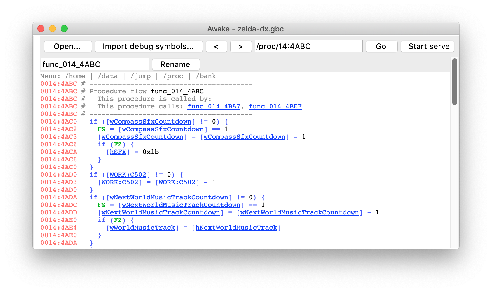

# Awake - Gameboy decompiler
- Author: Wojciech Marczenko (devdri) <wojtek.marczenko@gmail.com>
- License: GPLv3
- Python version: 2.7 (some features require PIL)

## Overview

This program makes exploring disassembled Game Boy binaries easier. It can detect function boundaries, and present C-like code in a browsable interface.

It is specially tuned for Zelda Link’s Awakening, and will present readable output for jump tables.



## Quick start

The program can run in two modes: window and webbrowser.

To start, just run:

```
python main.py
```

This will open the main window.

You can also directly open a rom:
	`python main.py roms/zelda.gb`

Or even a location within rom:
	`python main.py roms/zelda.gb /proc/40`

To run a headless http server on port 8888:
	`python main.py roms/zelda.gb --server`
	Then browse to `http://localhost:8888/proc/0000:0150`

Note:
	Use `zelda.gb` (MD5: `c4360f89e2b09a21307fe864258ecab7`) for best results.

Also note:
	To see cooler stuff you will need to run analysis which discovers code. Generate graphviz graphs. Sometimes manually override jumptable limits. This is not yet supported in user-friendly way and will require hacking the python code. Look at graph.py for examples. Warning: the code is a mess.

Third note:
	Many compatibility-breaking changes are coming and stuff will break, but stay tuned for cool new features.

Have fun!

## Contributions

kemenaran:
- Allow importing symbols from an external .SYM file
- Display more hardware addresses
